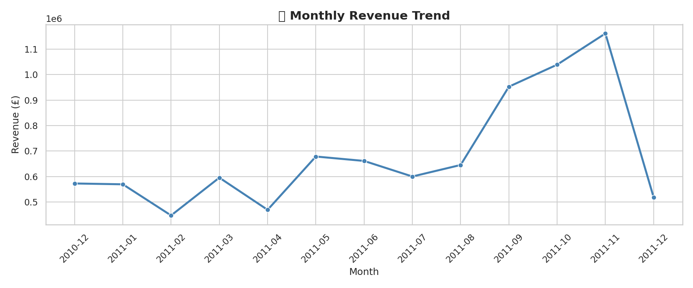
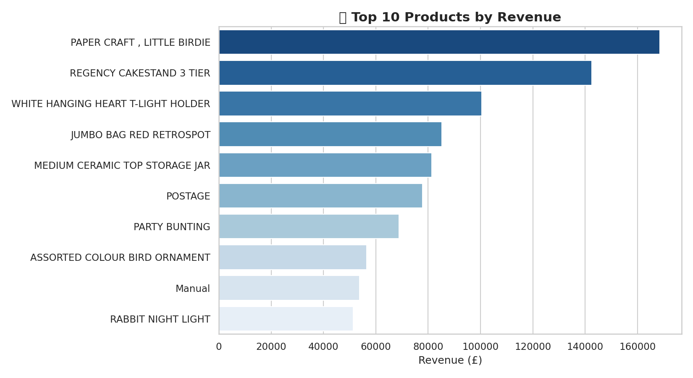
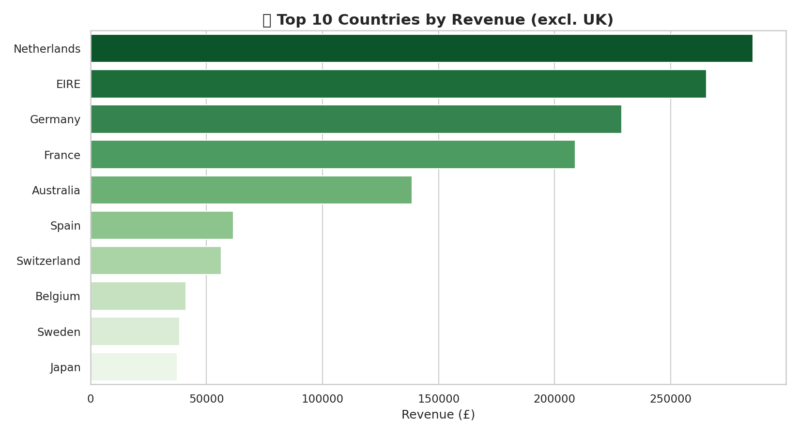
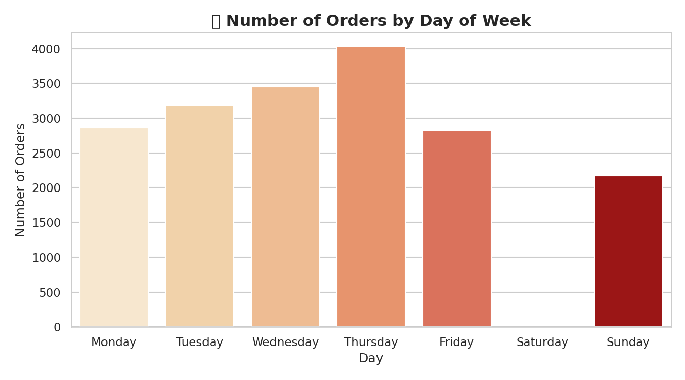
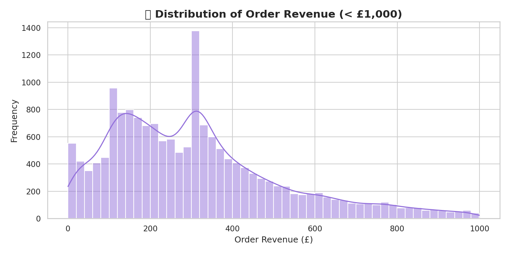
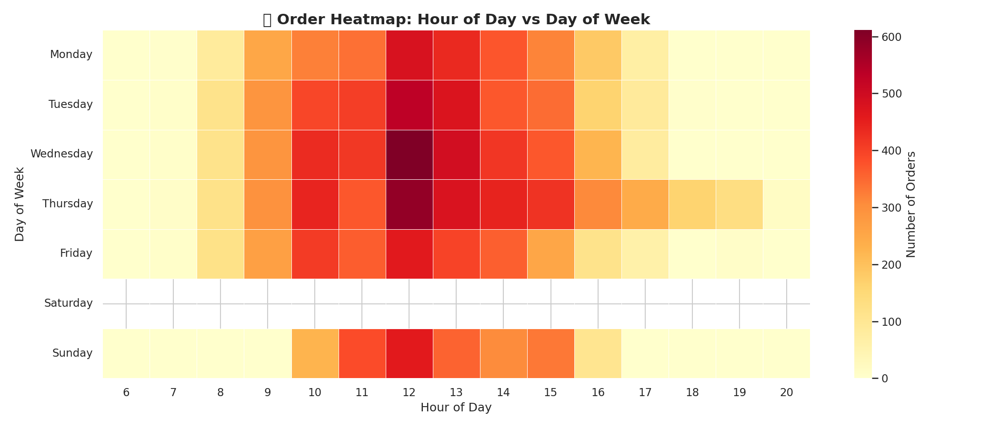

# E-Commerce Sales Analysis

## About the Project

This project analyzes an online retail dataset containing around 500,000 transactions from a UK-based store.

The goal is to understand sales trends, identify top-performing products, and gain insights into customer behavior.

---

## Tools Used

* Python
* Pandas
* NumPy
* Matplotlib
* Seaborn

---

## Work Done

* Cleaned raw data (removed missing values and cancellations)
* Created a Revenue column
* Performed analysis on products, countries, and time
* Built multiple visualizations

---

## Key Insights

* United Kingdom generates the highest revenue
* A few products contribute most of the sales
* Sales vary across months
* Certain days have higher order volume

---

## Project Output

### Monthly Revenue

### Top Products

### Top Countries

### Orders by Day

### Revenue Distribution

### Heatmap

---

## How to Run

pip install pandas matplotlib seaborn numpy openpyxl
python ecommerce_sales_analysis.py

---

## Dataset

UCI Online Retail dataset (2010–2011)
